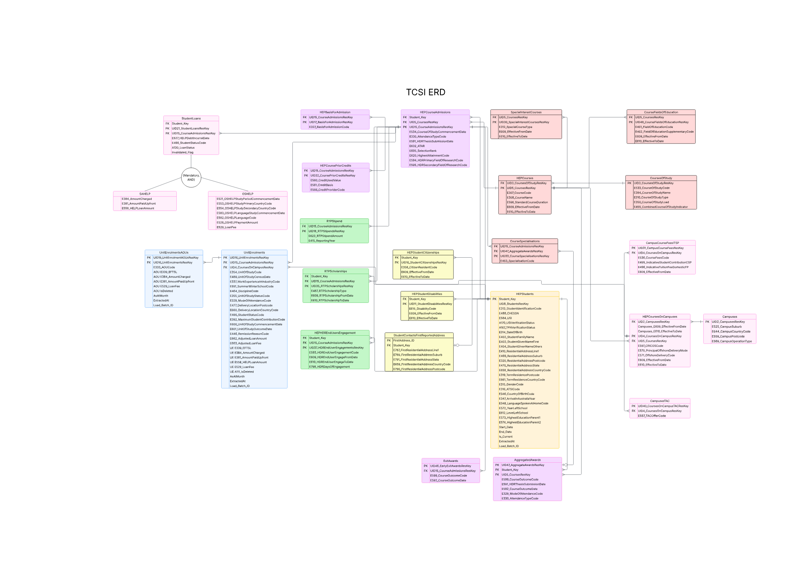

# Stage 2 – Normalised ERD & Data Model

## Overview
Stage 2 represents the **normalised ERD and data model** that was prepared for client review.  
This version focuses on reducing duplication, clarifying relationships, and ensuring the design directly supports TCSI reporting requirements.  
The model captures the full student journey — from admission through unit enrolments, campus offerings, awards, HDR elements, and loans — while maintaining **time-aware attributes** for historical accuracy.

---

## Key Design Highlights

### 1. The Study Spine
- **HEPStudents → HEPCourseAdmissions → HEPCourses → HEPCoursesOnCampuses**  
- This chain forms the **backbone of the data model**.  
- It enables clear traceability of “who studies what, and where.”  
- Campus-specific rules (fees, TAC) attach cleanly via the `CoursesOnCampuses` bridge.

---

### 2. Units Normalised
- **UnitEnrolments**: stores one row per student’s unit enrolment (status, mode, dates, EFTSL, amounts).  
- **UnitEnrolmentsAOUs**: stores the per-AOU breakdown for the same unit (faculty/department splits).  
- Both tables include **AsAtMonth, ExtractedAt, Load_Batch_ID** to support monthly extracts and point-in-time reporting.

---

### 3. Campus-Specific Pricing and Codes
- **UnitEnrolments → HEPCoursesOnCampuses → {CampusCourseFeesITSP, CampusesTAC}**  
- This deterministic path answers the common business question:  
  *“Which fee/TAC applies to this student’s enrolment?”*  

---

### 4. Awards
- **ExitAwards**: linked to Course Admissions, recording early/alternate outcomes.  
- **AggregatedAwards**: linked to Students and Courses, capturing terminal/final awards.  
- **CourseSpecialisations**: links admissions and awards, allowing majors/minors to align with outcomes.

---

### 5. HELP Loans
- **Original design:** a superclass `StudentLoans` with subclasses for SAHELP and OSHELP.  
- **Final decision:** SAHELP and OSHELP are now **separate independent tables**.  
- **Reasoning:** These are distinct loan types with no shared attributes in practice, so splitting simplifies the model.

---

## Client Suggestions & Adjustments

During the client review, the following points were raised:

### Primary Focus
- **Primary tables to keep:** Students, CourseAdmissions, UnitEnrolments, and their related sub-packets.  
- **Tables considered for removal:** Campus and CoursesOnCampus (later retained for fee and location logic).  
- **Critical relationship:** Student → CourseAdmission → UnitEnrolment.  

### Loan Restructuring
- **Original design:** StudentLoans superclass with SAHELP and OSHELP subclasses.  
- **Final decision:** Split SAHELP and OSHELP into independent tables.  
- **Reasoning:** They are fundamentally different loan types with no shared attributes.

### Column Removal in UnitEnrolments
The client recommended removing the following columns from **UnitEnrolments**, as they are always null:  
- `E446_RemissionReasonCode`  
- `A130_LoanStatus`  
- `UID21_StudentLoansResKey`  
- `E662_AdjustedLoanAmount`  
- `E663_AdjustedLoanFee`  
- `UE E339_EFTSL`  
- `UE E384_AmountCharged`  
- `UE E381_AmountPaidUpfront`  
- `UE E558_HELPLoanAmount`  
- `UE E529_LoanFee`  

This change will simplify the schema and remove unused attributes.

### Commonwealth Scholarship Packet
- After further review, the client requested that the **Commonwealth Scholarship packet** also be included in the database.  
- Its **table, relationships, and color coding** will be aligned with its main group. 
---

## Diagram

