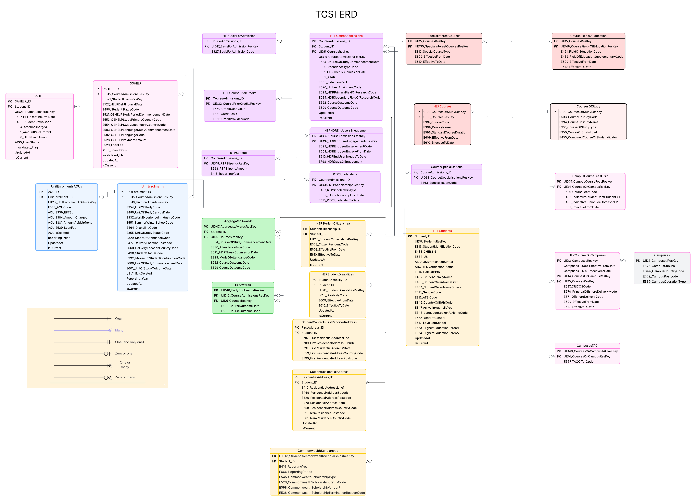

# Stage 4 – Final Refined ERD (Client Approved)

## Overview
Stage 4 is the **final, fully refined ERD** that incorporates all client feedback and technical adjustments.  
It aligns closely with TCSI specifications and simplifies history tracking.  
This is the **version approved for implementation**.

---

## Key Relationship Updates

- **SA-HELP linkage**  
  - **Now:** `SAHELP → Student`  
  - **Rationale:** Each SA-HELP loan packet must be linked to a **student packet**, not course admissions (per TCSI spec).

- **Aggregated Awards linkage**  
  - **Now:** `AggregatedAwards → Student` **and** `AggregatedAwards → Course`  
  - **Rationale:** Aggregated awards may exist without an admission; must link to both **student** and **course**.

- **Exit Awards linkage**  
  - **Now:** `ExitAwards → CourseAdmission` **and** `ExitAwards → Course`  
  - **Purpose:** Records the award the student actually completes, which may differ from the admission’s course.  
  - **Why link to Course as well?** The exit award itself defines a **course** that may not equal the original admission course.

---
## Structural Adjustments

### 1. Minimal SCD-2 Pattern
- Replaced `Start_Date`, `End_Date`, `AsAtMonth` with a leaner approach:  
  - `UpdatedAt` (effective-from timestamp of each version).  
  - `IsCurrent` (flag for current row per business key).  
- Benefits:  
  - Simpler ETL and change tracking.  
  - Avoids redundant time intervals.  
  - “As-of” queries can derive effective-to using **next UpdatedAt**.

### 2. Surrogate Keys
- Added surrogate keys to:  
  - `StudentCitizenship`  
  - `StudentDisabilities`  
  - `StudentResidentialAddress`  
  - `CourseAdmissions`  
  - `UnitEnrolments`  
  - `UnitEnrolmentsAOUs`  
  - `SAHELP`  
  - `OSHELP`  
- Benefit: makes SCD-2 easier and supports multiple versions per natural key.

### 3. Student Residential Address
- Split into its own table for **normalisation** and clean history management.  
- Maintains separation from the main `HEPStudents` table.

---

## Unit Enrolments & Fees

- **Removed** UnitEnrolments → CoursesOnCampus FK (`UID4_CoursesOnCampusResKey`) as it is not part of TCSI packets.  
- Fees and TAC can be resolved via:  
  `UnitEnrolment → CourseAdmission → Course → CoursesOnCampuses → {CampusCourseFeesITSP, CampusesTAC}`.  
- Optionally, ETL can maintain a **derived FK** if deterministic fee lookups are required.

---
## Benefits of Stage 4
- **Compliant** with TCSI specifications for packet linkages.  
- **Simplified history tracking** with minimal SCD-2.  
- **Better normalisation** with StudentResidentialAddress separated.  
- **Prepared for implementation** with surrogate keys, reporting year fields, and incremental-load traceability.

---

## Diagram

