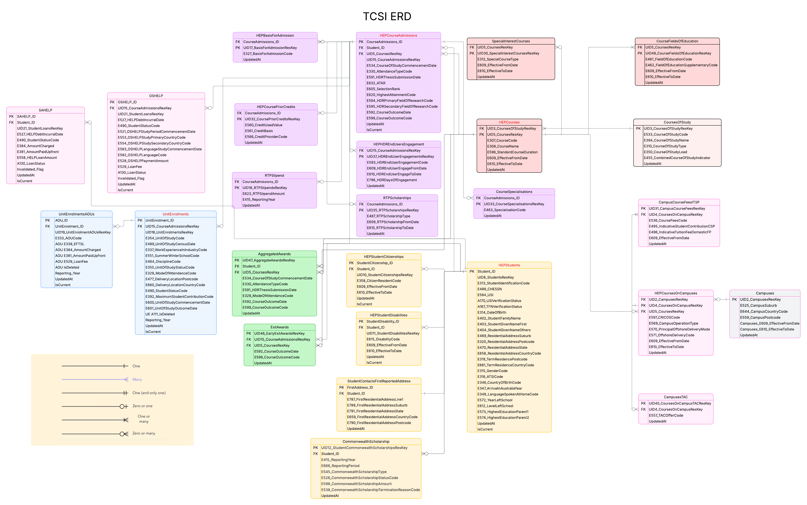

### Summary
This PR updates the ERD and schema to align with TCSI packet definitions, based on feedback from the latest client meeting.

### Changes
- **Student table**: Merged Student and StudentResidentialAddress back into a single table to match the TCSI packet structure.
- **Campus table**: Moved `Campuses_E609_EffectiveFromDate` and `Campuses_E610_EffectiveToDate` from HEPCoursesOnCampuses into Campuses, since effective dates apply at the campus level.
- Updated ERD diagram and documentation to reflect these corrections.

### Rationale
These adjustments were requested by the client to ensure our schema mirrors the official TCSI packet design and avoids inconsistencies in reporting.  

### Impact
- Simplifies the Student entity by removing unnecessary separation.
- Ensures effective date fields are applied at the correct entity level.
- Keeps database schema consistent with TCSI compliance requirements.

## Diagram

