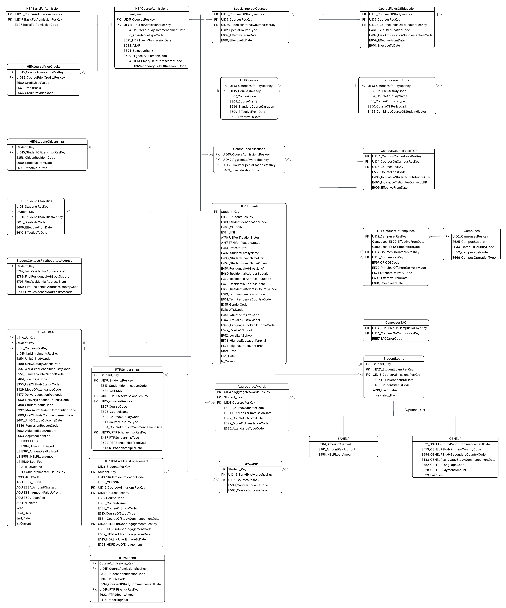

# Stage 1 – Initial ERD Draft

## Overview
Stage 1 represents the **first draft** of our Entity Relationship Diagram (ERD) for the TCSI Extract Database project.  
This version focused on mapping the **core TCSI entities** and setting the foundation for later refinements.

---

## Core Entities
- **Students**  
- **Courses**  
- **CourseAdmissions**  
- **Units-AOUs**  

---

## Key Features
- **Awards** taken directly from the TCSI packet structure (not separated or altered).  
- **Loans** included with SAHELP and OSHELP from the TCSI packet.  
- **Effective dating (E609/E610)** included from TCSI packet tables.  
- **SCD2 (Slowly Changing Dimension Type 2)** applied only in the **Student** table.  
- Early design introduced multiple **foreign keys** across tables to capture relationships.

---

## Areas for Improvement
- **Too many foreign keys** included at this stage; some will need simplification.  
- **Units-AOUs** structure may need to be refined in later stages.  
- Cardinalities not yet fully defined (e.g., Student → CourseAdmissions is expected to be 1–M).  
- Surrogate keys and natural keys need to be more clearly separated.  
- Naming conventions will require cleanup (avoid spaces/hyphens in table names).  

---

## Next Steps
- Review and reduce foreign keys to simplify relationships.  
- Define relationship **cardinalities** more explicitly.  
- Refine Units vs AOUs structure for better normalization.  
- Standardise naming and enforce uniqueness rules.  

---

## Diagram

