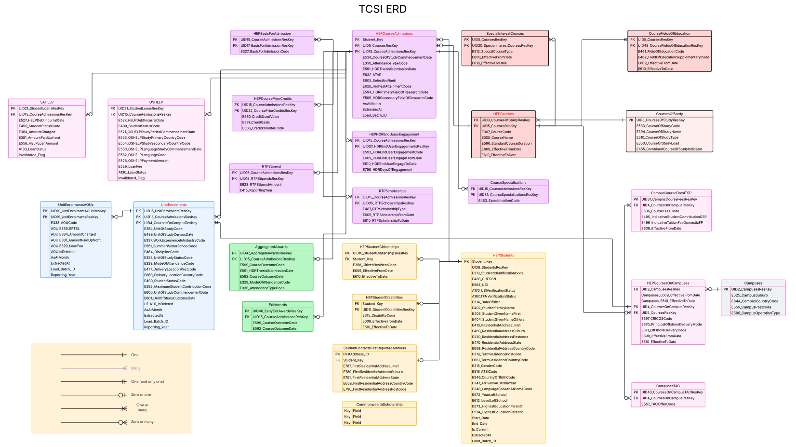

# Stage 3 – Refined ERD (Client Approved)

## Overview
Stage 3 is the **refined and client-approved ERD**.  
It integrates all feedback from earlier stages, removes redundant attributes, and introduces new elements to better support reporting and incremental data loads.  
This version represents the finalised design for implementation.

---

## Key Changes from Stage 2

### 1. Reporting Year Fields
- Added **Reporting_Year** to both **UnitEnrolments** and **UnitEnrolmentsAOUs**.  
- Enables **year-over-year analysis** directly from enrolment data.

### 2. Loan Structure Simplification
- Removed the general `StudentLoans` table.  
- Replaced with **two separate, fully defined tables**: `SAHELP` and `OSHELP`.  
- Simplifies schema and reflects the fact that the two loan types share little in practice.

### 3. Admissions Traceability
- `HEPCourseAdmissions` now includes:  
  - `AsAtMonth`  
  - `ExtractedAt`  
  - `Load_Batch_ID`  
- Improves tracking of incremental loads and supports **point-in-time reporting**.

### 4. Field Cleanup in UnitEnrolments
- Removed redundant/null fields as per client agreement:  
  - `E446_RemissionReasonCode`  
  - `A130_LoanStatus`  
  - `UID21_StudentLoansResKey`  
  - `E662_AdjustedLoanAmount`  
  - `E663_AdjustedLoanFee`  
  - `UE E384_AmountCharged`  
  - `UE E381_AmountPaidUpfront`  
  - `UE E558_HELPLoanAmount`  
  - `UE E529_LoanFee`  
- This reduces redundancy and simplifies the table.

### 5. Cardinality Adjustments
- Updated some crow’s-feet relationships to align more accurately with **business rules**.  
- Marked as **“Needs Review”** for further validation.

### 6. Commonwealth Scholarships
- A new **CommonwealthScholarship** table has been added.  
- At this stage, it is a **placeholder** pending delivery of the CSV packet.  
- Once provided, relationships and attributes will be aligned with the main group structure.

---

## Final Benefits
- **Cleaned and simplified structure**, eliminating unused attributes.  
- **Improved time-tracking** with Reporting Year fields and expanded traceability.  
- **Simplified loan structure** improves usability and reporting.  
- Ready for ETL integration, monthly extracts, and KPI tracking.  
- Incorporates all client feedback and stands as the **final approved ERD**.

---

## Diagram

